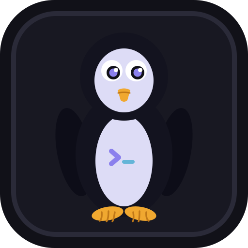
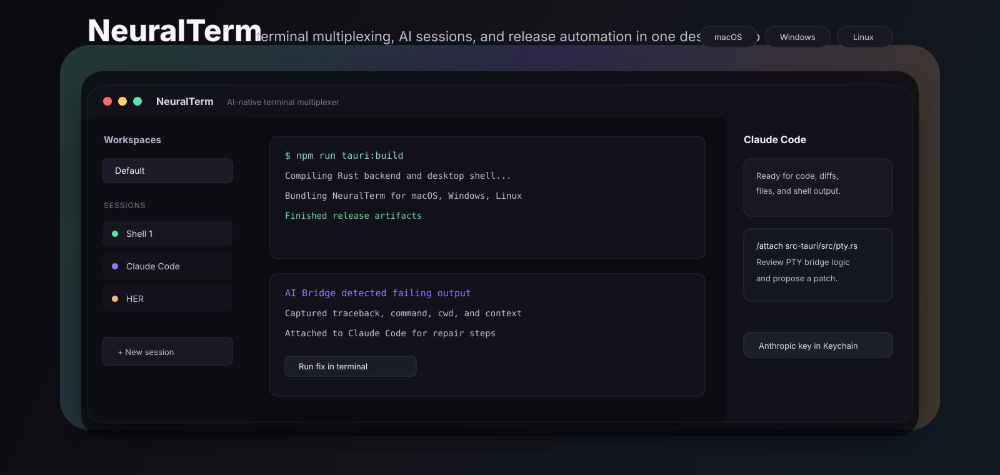
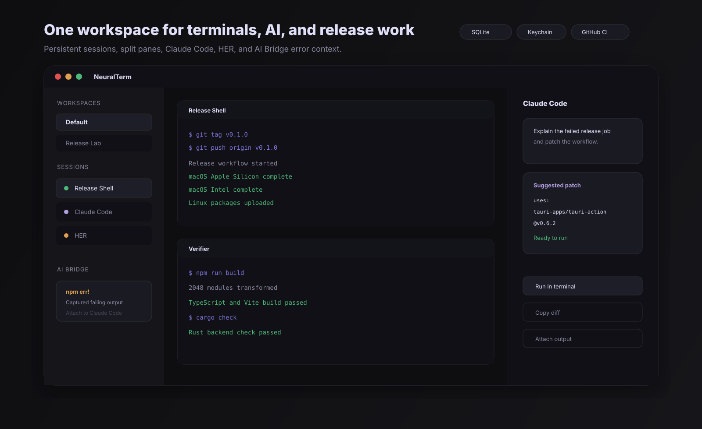

<p align="center">
  
</p>

<h1 align="center">NeuralTerm</h1>

<p align="center">
  <strong>An AI-native desktop terminal multiplexer for real work: shells, split panes, Claude sessions, terminal-output context, and cross-platform releases.</strong>
</p>

<p align="center">
  <a href="https://github.com/Anuragh33/neuralterm/releases/latest"></a>
  
  
  
  
</p>

<p align="center">
  
</p>

## What Is NeuralTerm?

NeuralTerm is a Tauri desktop app that combines a practical terminal workspace with AI sessions built for coding flow. It gives you persistent workspaces, tabs, split panes, native PTYs, SQLite session storage, Claude Code/HER panes, and an AI Bridge that turns suspicious terminal output into assistant-ready context.

The goal is simple: keep your terminal, build errors, project context, and repair loop in one focused desktop surface.

## Download

The latest release is available on GitHub:

**[Download the latest NeuralTerm release](https://github.com/Anuragh33/neuralterm/releases/latest)**

| Platform | Recommended Asset | Notes |
| --- | --- | --- |
| macOS Apple Silicon | `NeuralTerm_0.2.0_aarch64.dmg` | For M1/M2/M3/M4 Macs |
| macOS Intel | `NeuralTerm_0.2.0_x64.dmg` | For Intel Macs |
| Windows | `NeuralTerm_0.2.0_x64-setup.exe` | Installer executable |
| Windows | `NeuralTerm_0.2.0_x64_en-US.msi` | MSI package |
| Linux | `NeuralTerm_0.2.0_amd64.AppImage` | Portable Linux app |
| Linux Debian/Ubuntu | `NeuralTerm_0.2.0_amd64.deb` | Debian package |
| Linux Fedora/RHEL | `NeuralTerm-0.2.0-1.x86_64.rpm` | RPM package |

The current release artifacts are unsigned. macOS Gatekeeper and Windows SmartScreen may show trust warnings until code signing and notarization are configured.

## Preview

<p align="center">
  
</p>

## Highlights

| Area | What It Does |
| --- | --- |
| Native terminals | Runs real shell sessions through a Rust `portable-pty` backend in the Tauri app |
| Split panes | Horizontal and vertical splits with draggable dividers and focused pane state |
| Workspaces | Persistent workspace groups with collapsible sidebar organization |
| Sessions | Shell, Claude Code, and HER sessions live side-by-side in the same app model |
| AI Bridge | Watches terminal output for errors, crashes, failing commands, and suspicious output |
| AI context handoff | Sends captured terminal excerpts into Claude Code sessions for debugging |
| AI commands | Supports `/clear`, `/attach <path>`, and `/shell <cmd>` inside AI sessions |
| Run-in-terminal | Code blocks from AI responses can be sent directly into a shell session |
| Secure key storage | Anthropic API key is stored in the OS keychain in the desktop app |
| Release automation | GitHub Actions builds macOS, Windows, and Linux release assets from version tags |

## Feature Tour

### Terminal Workspace

- Real PTY-backed shell sessions in the desktop app
- Browser preview fallback for frontend development
- xterm.js rendering with fit, search, and web-link addons
- Session lifecycle controls for spawn, resize, write, and kill
- Activity tracking, CWD detection, and persisted terminal scrollback

### Multiplexer UX

- Resizable and collapsible sidebar
- Full workspace create, rename, reorder, recolor, move-session, and delete workflows
- Split right and split down controls
- Focus navigation between panes
- Command palette for shell, AI, settings, and layout commands
- Keyboard shortcuts, drag-reorderable tabs, and an opt-in global quick launcher

### Claude Code And HER

- Claude Code session type for coding assistance
- HER session type with mood tinting and voice input support where the browser/webview allows it
- Markdown rendering with syntax highlighting
- Copy and run controls for code blocks
- File attachment through `/attach <path>`
- Shell helper through `/shell <cmd>`
- Message history stored in SQLite

### AI Bridge

AI Bridge listens for terminal output patterns such as:

- tracebacks
- uncaught exceptions
- panics
- `npm ERR!`
- permission failures
- fatal git errors
- segmentation faults
- failed commands and non-zero exit hints

When it detects an issue, NeuralTerm captures an excerpt and offers to open or reuse a Claude Code session with that context attached.

## Architecture

```text
NeuralTerm
├─ Frontend: React + TypeScript + Vite + Tailwind
├─ State: Zustand stores for sessions, workspaces, splits, settings, and bridge alerts
├─ Terminal: xterm.js with fit/search/web-links addons
├─ Desktop shell: Tauri v2
├─ Backend: Rust commands for PTY, SQLite, keychain, and helper tools
├─ Persistence: SQLite under the app data directory
└─ Releases: GitHub Actions matrix for macOS, Windows, and Linux
```

## Development

Install dependencies:

```bash
npm install
```

Run the browser preview:

```bash
npm run dev
```

Run the full Tauri desktop app:

```bash
npm run tauri:dev
```

Build frontend assets:

```bash
npm run build
```

Build desktop bundles locally:

```bash
npm run tauri:build
```

The dev server uses `http://127.0.0.1:1421/`.

Run the complete verification suite:

```bash
npm run check
```

## Project Website

The project website is a Next.js app under `website/`.

```bash
npm run site:dev
npm run site:build
```

The website dev server uses `http://127.0.0.1:4321/`.

## AI Setup

1. Open Settings in the app.
2. Add an Anthropic API key.
3. Choose the default model.
4. Create a Claude Code or HER session from the command palette.

In the Tauri app, the API key is stored with the OS keychain. In browser preview mode, storage falls back to local browser storage.

## Releases

GitHub Releases are configured in [`.github/workflows/release.yml`](.github/workflows/release.yml). A version tag builds platform assets automatically:

```bash
git tag v0.2.0
git push origin v0.2.0
```

The workflow builds:

- macOS Apple Silicon
- macOS Intel
- Windows
- Linux

See [docs/release.md](docs/release.md) for the release checklist, signing notes, and cost breakdown.

## Current Status

- `v0.2.0` adds complete workspace management, onboarding, persisted split/terminal context, updater support, CI, and automated tests.
- macOS, Windows, and Linux assets are built by GitHub Actions.
- In-app updates are signed with a dedicated Tauri updater key.
- Platform trust signing and macOS notarization are not configured yet.

## Tech Stack

| Layer | Tools |
| --- | --- |
| Desktop | Tauri v2 |
| Backend | Rust, `portable-pty`, `sqlx`, `keyring`, `tokio` |
| Frontend | React, TypeScript, Vite, Tailwind |
| Terminal | xterm.js |
| AI | Anthropic SDK |
| State | Zustand |
| Persistence | SQLite |
| CI/CD | GitHub Actions, Tauri release action |

## Security Notes

- Anthropic API keys are not committed or bundled.
- The desktop app stores the API key through OS keychain integration.
- In-app updater packages are signed independently from platform trust signing.
- Unsigned builds are useful for testing but not ideal for broad public distribution.

## License

NeuralTerm is available under the [MIT License](LICENSE).
